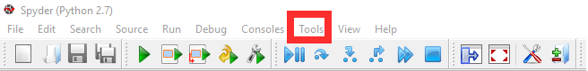
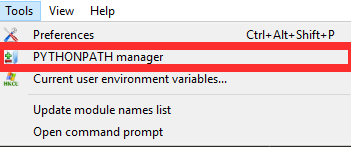
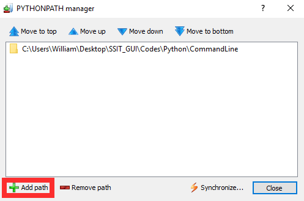

===============
Installation 
===============

.. contents::
	:depth: 5
	
Installing rSNAPsim
~~~~~~~~~~~~~~~~~~~~~~~~~~~~~~~~~~~~~~~~~~~~~~~~~~~~~~

Dependencies 
=============

* Python 2.7 or Python 3.5+
* `SciPy <https://www.scipy.org/>`_
	- NumPy
	- SymPy
	- Matplotlib
* `BioPython <https://biopython.org/>`_

	
Recommended Enviroment
=========================

`Anaconda 2.7 or 3.5+ <https://conda.io/docs/user-guide/install/download.html>`_

Manually Compiling the Stochastic Simulation for C++
=====================================================

Download :download:`translation_ssa <translation_ssa_v01.zip>` and uncompress it.

Download `Eigen <http://eigen.tuxfamily.org/index.php?title=Main_Page>`_ and place it in the translation_ssa folder

Windows:

* open a new command prompt 
* change directory to the translation_ssa 
* run the following command: "python setup.py build_ext"
	* if this doesnt work, try adding --inplace at the end of the command

Mac / Linux:

* open a new terminal window
* change directory to the translation_ssa 
* run the following command: "python setup.py build_ext"
	* if this doesnt work, try adding --inplace at the end of the command

then add ssa_translation to your python path

::

	import sys
	sys.path   #prints current packages
	sys.path.append('directory of translation_ssa folder')
	
From here the C++ library for under sms.ssa_solver or sms.ssa

Download
===============
`Github <https://github.com/MunskyGroup/rSNAPsim>`_

Adding rSNAPsim to System path directly
========================================

Python enviroment variables can be accessed and adjusted by opening a new Python console and appending sys.path

::

	import sys
	sys.path   #prints current packages
	sys.path.append('directory of downloaded rSNAPsim')
	

Adding rSNAPsim to Spyder IDE
==============================

Tools > PYTHONPATH Manager > Add path > select directory to rSNAPsim
	

	
	
Pip Install
===============

General
******** 

open up a Terminal or Command Prompt and run 

.. pip install rSNAPsim 

Anaconda
*********

Open up the Anaconda Prompt (anaconda console) and run 

.. conda pip install rSNAPsim 
	
	
	

