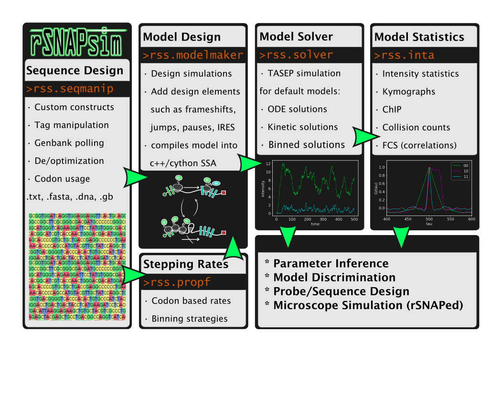

=============
Introduction
=============

.. contents::
	:depth: 2
	

The **R**\NA **S**\equence to **NA**\scent **P**\rotein **Sim**\ulation(rSNAPsim) is a Python module 
that provides several useful submodules for designing, simulating, analyzing, and fitting mRNA translation models. 
The core functionality is to go from a nucleotide sequence to codon-dependent TASEP translation model.

-------

rSNAPsim provides built in methods for the following:

* Reading and manipulating mRNA sequences at the nucleotide or amino acid level
	* sequence optimization / deoptimization 
	* codon bias metric calculations (CAI, tAI)
	* fluorescent tag editing
* Solving simulations of ribosomal movement on mRNA
	* Multicolor Fluorescent tag simulations
	* Gillespie, ODE, Ballistic solutions
	* Collision statistics and simulations
	* Ribosomal loading / density / dwell times
	* FRAP and Inhibitor (Harringtonine) simulations
	* Kymograph creation
* Analyzing intensity traces from simulated nascent chain tracking
	* Intensity auto/cross-correlations or covariances
	* Coarse correlation plots
	* Analytical moment solutions (for ODE models)
* Novel models
	* custom model builder: Create simulations of phenomena like frameshifting, IRES, run-through stops 
	* tRNA pool resource simulation
	* vRNA replicon simulation (arbitrary protease cleavage sites)
* Flourescent Intensity Analysis
	* FCS, Multicolor Correlations
	* Intensity statistics 
* Optimization 
	* Load and manage intensity data and fit to provided models
	* Metropolis Hastings / scipy optimization

Installation
~~~~~~~~~~~~~

Dependencies 
=============

* Python 2.7 or Python 3.5+
* `SciPy <https://www.scipy.org/>`_
	- NumPy
	- Matplotlib
* `BioPython <https://biopython.org/>`_
* `Pandas <https://pandas.pydata.org/>`_
* `Snapgene-reader <https://pypi.org/project/snapgene-reader/>`_
* `dna-features-viewer <https://edinburgh-genome-foundry.github.io/DnaFeaturesViewer/>`_

	
Pip install
=============
::

	conda install eigen
	pip install rsnapsim
	pip install rsnapsim-ssa-cpp	

`c++ models <https://pypi.org/project/rsnapsim-ssa-cpp/>`_

`rsnapsim package <https://pypi.org/project/rsnapsim/>`_

Recommended Enviroment
=========================

`Anaconda 2.7 or 3.5+ <https://conda.io/docs/user-guide/install/download.html>`_

Its recommended to create a new base conda enviroment as well:

:: 

	conda create --name <myenv> python=<python_version>
	conda activate myenv
	

Conda install
=============
::

	conda install eigen
	pip install rsnapsim
	pip install rsnapsim-ssa-cpp

If the rsnapsim-ssa-cpp fails to compile / install, you may have to include some custom compilers in the anaconda enviroment to point too:

Linux
-----------
::

	conda install -c anaconda gxx_linux-64
	conda install -c anaconda gcc_linux-64

MacOS
-------

::

	conda install -c anaconda clang_osx-64
	conda install -c anaconda clangxx_osx-64

Google colab
-------------

::

	%%capture
	!apt install libeigen3-dev
	!ln -sf /usr/include/eigen3/Eigen /usr/include/Eigen
	!pip install rsnapsim-ssa-cpp
	!pip install rsnapsim
	!pip install --upgrade rsnapsim 

Download
===============
`Github <https://github.com/MunskyGroup/rSNAPsim>`_

Future Work
~~~~~~~~~~~~~~

